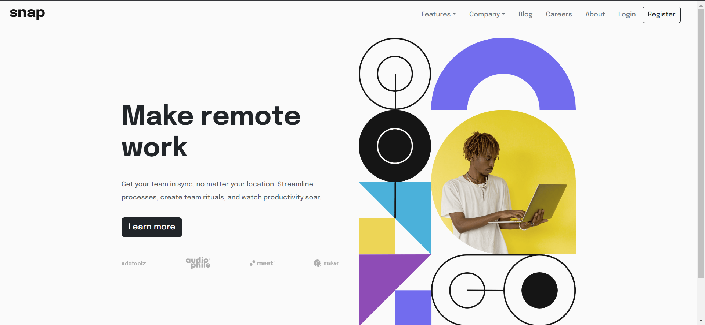
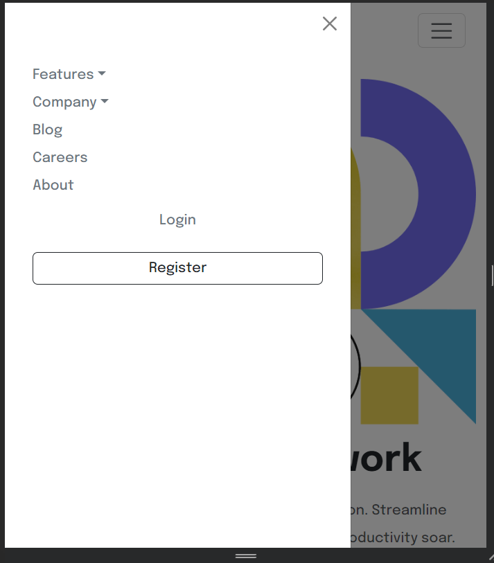
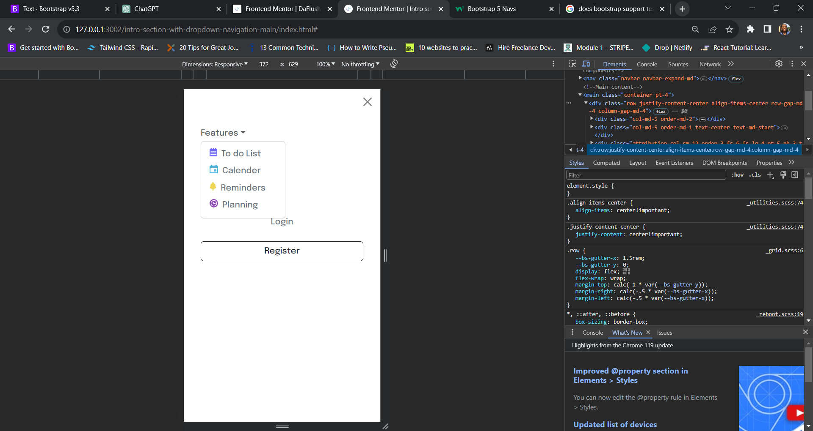

# Frontend Mentor - Intro section with dropdown navigation solution

This is a solution to the [Intro section with dropdown navigation challenge on Frontend Mentor](https://www.frontendmentor.io/challenges/intro-section-with-dropdown-navigation-ryaPetHE5). Frontend Mentor challenges help you improve your coding skills by building realistic projects. 

## Table of contents

- [Overview](#overview)
  - [The challenge](#the-challenge)
  - [Screenshot](#screenshot)
  - [Links](#links)
- [My process](#my-process)
  - [Built with](#built-with)
  - [What I learned](#what-i-learned)
  - [Continued development](#continued-development)
  - [Useful resources](#useful-resources)
- [Author](#author)
- [Acknowledgments](#acknowledgments)


## Overview

### The challenge

Users should be able to:

- View the relevant dropdown menus on desktop and mobile when interacting with the navigation links
- View the optimal layout for the content depending on their device's screen size
- See hover states for all interactive elements on the page

### Screenshot







### Links

- Solution URL: [Add solution URL here](https://your-solution-url.com)
- Live Site URL: [Add live site URL here](https://your-live-site-url.com)

## My process

### Built with

- Semantic HTML5 markup
- CSS custom properties
- Mobile-first workflow
- [Bootstrap](https://reactjs.org/) - CSS and JS library


### What I learned
I have definitely come a long way this past week. From learning sass to learning how to customize bootstrap styles using sass. Since, this challenge did not require much custom styles, I used plain css.

```html
<h1>Some CSS code I'm proud of</h1>
```
```css
 ul a .custom-list-one::before{
      content: url('/intro-section-with-dropdown-navigation-main/images/icon-todo.svg');
      margin-right: 0.5rem;
  }


### Continued development

I had a quite a hardtime merging responsive navigation with the bootstrap offcanvas. Since the default bootstrap navigation is quite different from that used in the challenge.


### Useful resources

- [ resource 1](https://www.w3schools.com) - Always my go to site when in doubt.
- [resource 2](https://www.openai.com) - I began using chatgpt3.5(the free version) quite recently following a youtube tutorial on prompt engineering offered via codecamp. It was quite useful in troubleshooting.

## Author

- Github - [Joy Ibe](https://www.github.com/DaFlusher)
- Frontend Mentor - [@DaFlusher](https://www.frontendmentor.io/profile/DaFlusher)
- Twitter - [@Joyibe17](https://www.twitter.com/Joyibe17)


## Acknowledgments

I would like to thank Freecodecamp and iaunshaunjp(netninja) for helping me get started with sass and bootstrap customization via their youtube videos.
